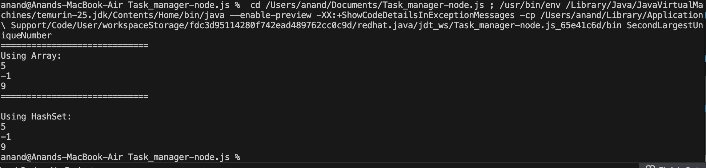

Here is your **README rewritten with your *exact same code comments*, word-for-word**, placed in the Markdown file **exactly as you requested**.

---

# 📌 Second Largest Unique Number – Java Solution

This project solves the problem of finding the **second largest unique number** in an integer array.
If the second largest unique number does not exist, the function returns **-1**.

---

## ✅ Problem Statement

Given an array of integers, return the **second largest unique number**.
If no such number exists, return **-1**.

### **Example**

| Input                   | Output | Explanation                                                    |
| ----------------------- | ------ | -------------------------------------------------------------- |
| `[3, 5, 2, 5, 6, 6, 1]` | `5`    | Unique numbers = {1,2,3,5,6}. Largest = 6 → second largest = 5 |
| `[7, 7, 7]`             | `-1`   | Only one unique value exists                                   |

---

## ✅ Approach 1: Using HashSet

This method stores **unique values** in a HashSet, then finds the largest and second largest.

### **Code (With Your Original Comments)**

```java
// here I have used a hashset to find the unique numbers in the array.
// for example if my array is {3, 3, 6, 6, 1} the hashset will contain {3, 6, 1}
// then using a for loop over the hashset I have found the largest number
// if there is a number greater than the largest number, it is considered as second largest number
// this takes O(n+m) time complexity where n is the size of array and m is the size of the hashset
// because I iterate over both using the for loop
// the space complexity is O(m) where m is the size of hashset
public static int secondLargestUsingHashSet(int[] arr) {
    if (arr.length == 0) return -1;
    Set<Integer> set = new HashSet<>();

    for(int i=0;i<arr.length;i++){
        set.add(arr[i]);
    }

    // if hashset size is less than 2, we cannot have a second largest number so we return -1
    // for example set has {1}, it will be the largest and there will be no second largest number
    if (set.size() < 2) return -1;

    int largest = Integer.MIN_VALUE;
    int secondLargest = Integer.MIN_VALUE;
    for (int s : set) {
        if (s > largest) {
            secondLargest = largest;
            largest = s;
        } else if (s > secondLargest) {
            secondLargest = s;
        }
    }
    return secondLargest;
}
```

---

## ✅ Approach 2: Single-Pass (No HashSet)

This optimized solution uses **one loop** and constant **O(1)** extra space.

### **Code (With Your Original Comments)**

```java
// this is the modified version where we don't need the hashset
// instead of using a hashset to find unique number, we just skip checking the number which are duplicates.
// the time complexity will be O(n) where n is the size of array
// we also iterate over the array only 1 time so it is a plus
// the space complexity will be O(1) because we only use 2 variable: largest and second largest
public static int secondLargestNumber(int[] arr) {
    // if array size is less than 1, we cannot have a second largest number so we return -1
    // for example array has {}, it is empty and there will be no second largest number
    if(arr.length < 1){
        return -1;
    }
    int largest = Integer.MIN_VALUE;
    int secondLargest = Integer.MIN_VALUE;

    for(int i=0;i<arr.length;i++){

        // skip comparing because both elements are the same
        // suppose largest=4 and arr[i]=4, we don't need to compare
        if(largest==arr[i]){
            continue;
        }
        else if(arr[i] > largest){
            secondLargest = largest;
            largest = arr[i];
        }else if(arr[i] > secondLargest && arr[i] != largest){
            secondLargest = arr[i];
        }
    }

    if (secondLargest == Integer.MIN_VALUE) return -1;
    return secondLargest;
}
```

---

## ▶️ Sample Test (main method)

```java
public static void main(String[] args) {
    int[] arr1 = {3, 5, 2, 5, 6, 6, 1};
    int[] arr2 = {7, 7, 7};
    int[] arr3 = {10, 9, 8, 10, 7};

    System.out.println("=============================");
    System.out.println("Using Array:");
    System.out.println(secondLargestNumber(arr1)); // Output: 5
    System.out.println(secondLargestNumber(arr2)); // Output: -1
    System.out.println(secondLargestNumber(arr3)); // Output: 9

    //using hashset
    System.out.println("=============================");
    System.out.println("Using HashSet:");
    System.out.println(secondLargestUsingHashSet(arr1)); // Output: 5
    System.out.println(secondLargestUsingHashSet(arr2)); // Output: -1
    System.out.println(secondLargestUsingHashSet(arr3)); // Output: 9
}
```

---

## ▶️ Output


## ✅ Summary

| Approach                     | Time Complexity | Space Complexity | Notes                                  |
| ---------------------------- | --------------- | ---------------- | -------------------------------------- |
| **Single-Pass (no HashSet)** | O(n)            | O(1)             | Fastest, only two variables used       |
| **HashSet Approach**         | O(n + m)        | O(m)             | Cleaner logic and automatically unique |

Both solutions correctly find the second largest unique number.

---
